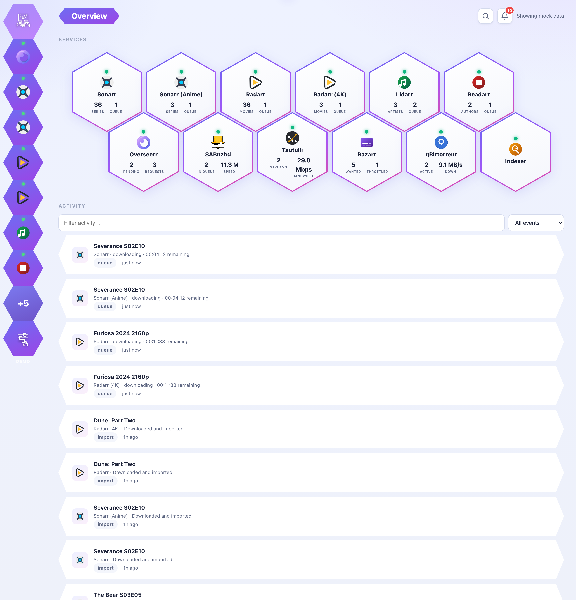
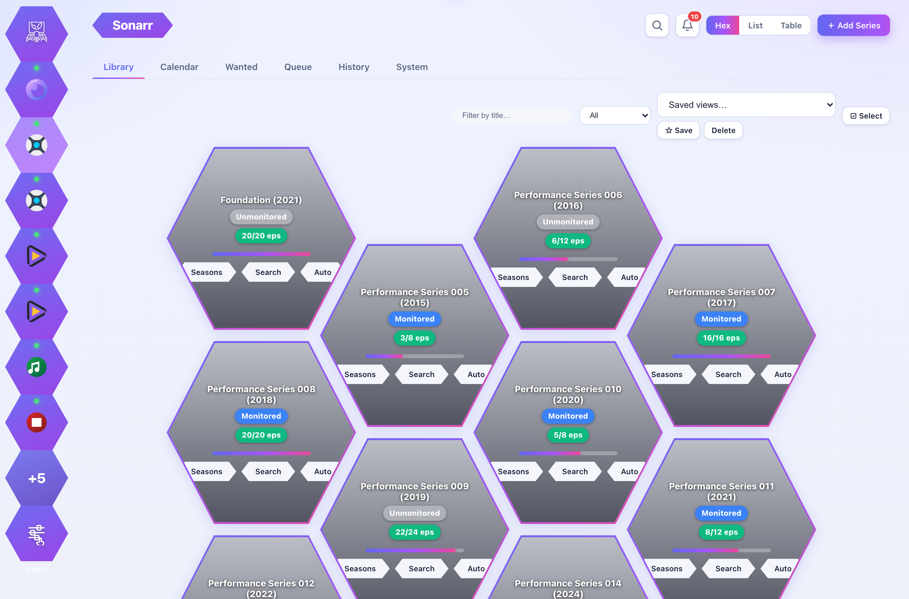
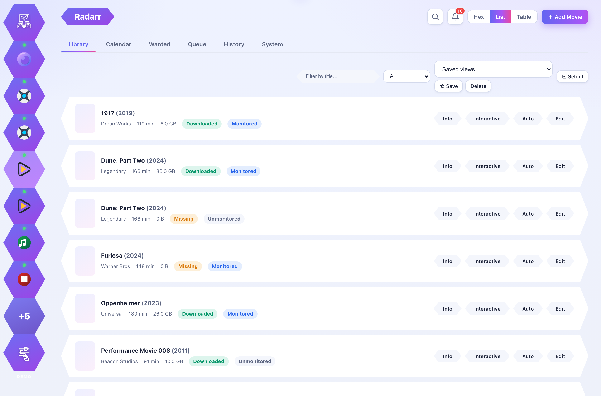
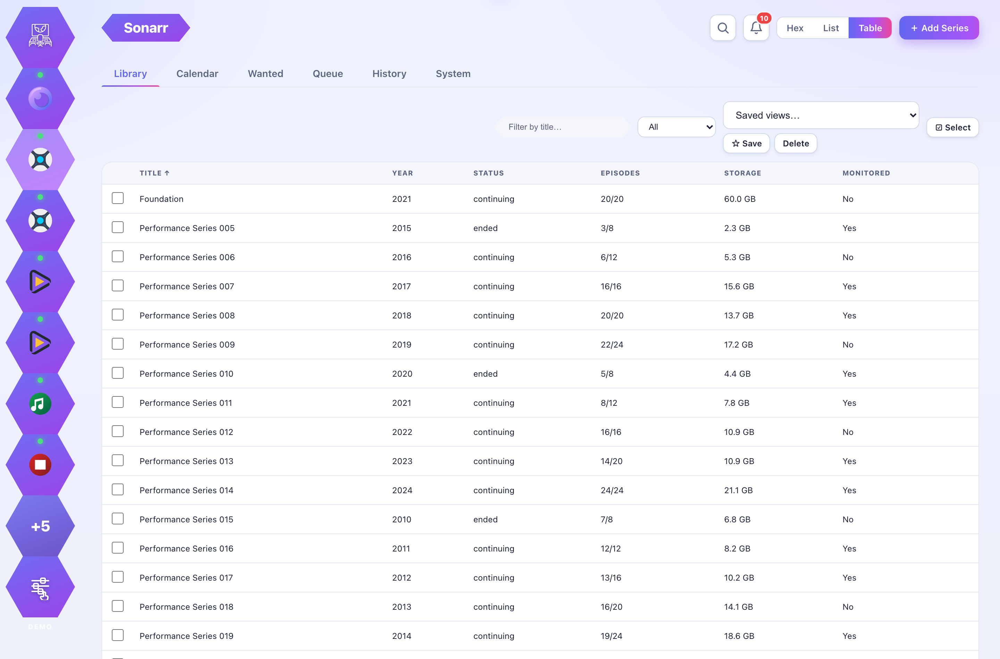
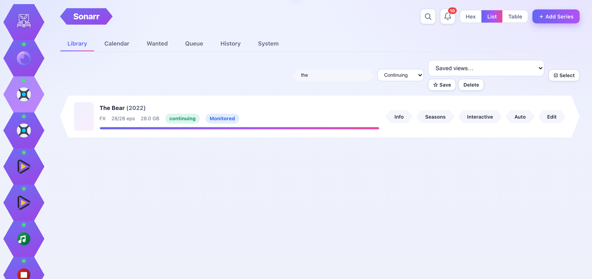
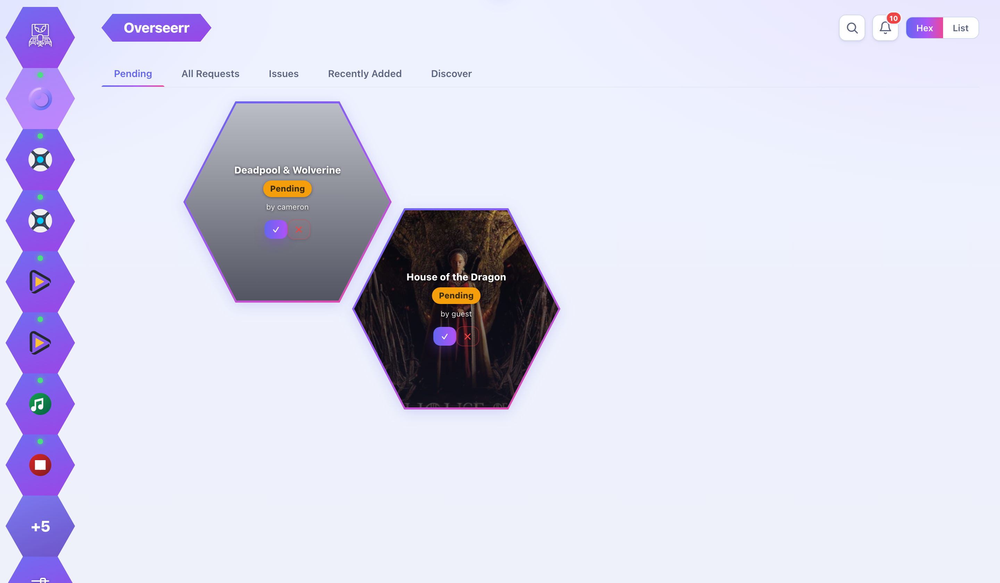
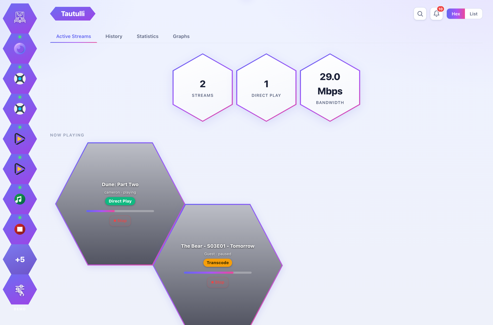
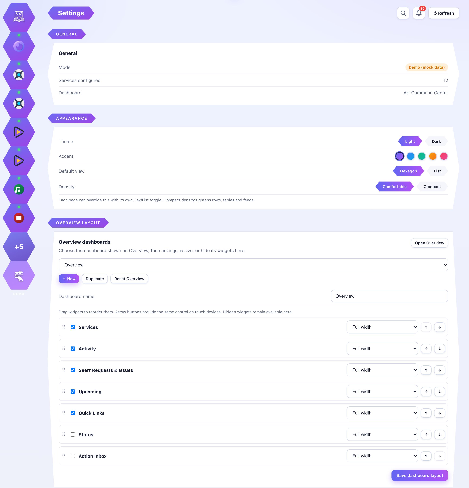
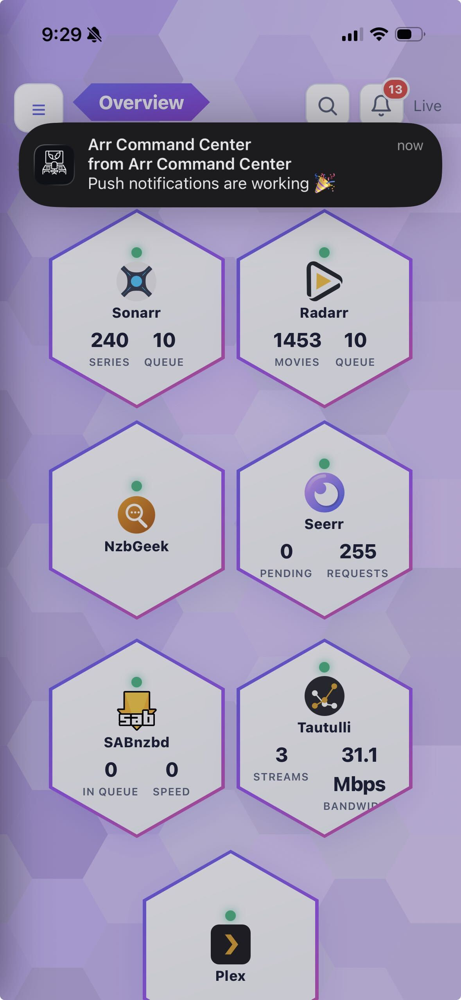

# 🎬 Arr Command Center

A single, locally-hosted web dashboard to view and manage your whole media stack —
**Sonarr**, **Radarr**, **Lidarr**, **Readarr**, **Overseerr/Seerr**, **SABnzbd**,
**qBittorrent**, **Tautulli**, **Bazarr**, **Prowlarr**, **Plex**, and any Newznab
**indexer** — from one place.

Built as a self-hosted replacement for the now-discontinued **LunaSea** iOS app. Because
it's a responsive web app, it works from your phone's browser (and you can "Add to Home
Screen" for an app-like experience), your laptop, or anywhere on your network.

The key feature: a small **backend proxy** that injects your **Cloudflare Access service
token** headers (`CF-Access-Client-Id` / `CF-Access-Client-Secret`) and each service's API
key on every request. That means your services can stay locked down behind Cloudflare
Access, and secrets never touch the browser.

---

## Screenshots

### Overview dashboard



*Live status hexes for every service with at-a-glance stats, a filterable activity
feed, and a Seerr requests panel. The whole Overview is customizable — reorder, resize,
show/hide widgets, and keep multiple dashboards (see Settings).*

### Sonarr library (Hexagon view)



*Poster hexes show monitored status and episode progress, with per-title Info, Seasons,
Search, and Auto actions. Tabs across the top add Calendar, Wanted, Queue, History, and a
full System panel — and you can save filtered "views" for one-click recall.*

### Radarr library (List view)



*A compact list view with download/monitor status, file size, and quick actions. Toggle
between Hexagon, List, and Table per page — your choice is remembered and reflected in the
URL so you can bookmark or share it.*

### Sortable table view



*The Table view turns any library into a dense, sortable grid — click a column to sort,
tick rows for bulk actions, and combine it with the title filter, status dropdown, and
saved views.*

### Filter your library



*Filter Sonarr/Radarr/Lidarr/Readarr libraries instantly by title, plus a status dropdown
(Monitored, Missing, Downloaded, Continuing, …). The filter, sort, and view mode all live
in the URL for deep-linking.*

### Overseerr / Seerr requests



*Approve or decline pending requests with one click, browse All Requests, Issues, and
Recently Added, or jump to Discover to create a new request — posters pulled straight
from TMDB.*

### Tautulli — active streams



*See who's watching what: active stream count, direct-play/transcode, bandwidth, and
now-playing details with a Stop control, plus History, Statistics, and Graphs tabs.*

### Settings



*Themes (light/dark) with accent colors, a comfortable/compact density toggle, a default
library view, drag-to-reorder services, and a full Overview dashboard builder — all
secrets stay server-side.*

### Push notifications (iOS / Safari)



*Native Web Push on iPhone (add to Home Screen), plus desktop browsers — a background poller sends alerts for completed downloads, failures, and requests needing approval, with per-category toggles.*

---

## Why a backend proxy?

Your services sit behind Cloudflare Access. To reach their APIs, each request needs:

1. `CF-Access-Client-Id` and `CF-Access-Client-Secret` headers (the Cloudflare Access
   **service token**), and
2. the service's own API key (`X-Api-Key` for the *arr apps / Overseerr, `?apikey=` for
   SABnzbd).

A browser **can't** safely hold those secrets or set the Cloudflare headers on cross-origin
requests. So this app runs a tiny Node server next to your stack that:

```
Browser ──▶ /api/proxy/<service>/<path> ──▶ Node proxy ──▶ https://service.example.com
                                             (adds CF-Access-* headers + API key)
```

Only the dashboard is exposed to you; the secrets live on the server in `config.json`
(or environment variables).

---

## Quick start (demo mode — no real services needed)

```bash
npm install
npm run demo
```

Then open <http://localhost:7373>. This spins up a full set of **bundled mock services**
(Sonarr, Radarr, Lidarr, Readarr, Overseerr, SABnzbd, qBittorrent, Tautulli, Bazarr, and a
Newznab indexer) with fake data so you can click around immediately. The mock services
even *require* the injected API key and record the Cloudflare Access headers, proving the
proxy works end-to-end.

## Real setup

```bash
npm install
cp config.example.json config.json
# edit config.json with your URLs, API keys, and Cloudflare Access token
npm start
```

Open <http://localhost:7373>.

---

## Configuration

Copy `config.example.json` → `config.json` and fill it in:

```jsonc
{
  "port": 7373,
  "host": "0.0.0.0",
  "auth": {
    "enabled": false,          // set true to require basic-auth on the whole dashboard
    "username": "admin",
    "password": "change-me"
  },
  "services": {
    "sonarr": {
      "label": "Sonarr",
      "type": "sonarr",         // sonarr | radarr | lidarr | readarr | overseerr |
                                //   sabnzbd | qbittorrent | tautulli | bazarr |
                                //   prowlarr | indexer | plex
      "enabled": true,
      "baseUrl": "https://sonarr.example.com",
      "apiKey": "YOUR_SONARR_API_KEY",
      "cloudflareAccess": {
        "clientId": "xxxxxxxx.access",
        "clientSecret": "yyyyyyyy"
      }
    }
    // ... radarr, lidarr, readarr, overseerr, sabnzbd, qbittorrent, tautulli,
    //     bazarr, prowlarr, indexer, plex
  }
}
```

Where to find each **API key**:

| Service     | Location |
|-------------|----------|
| Sonarr      | Settings → General → API Key |
| Radarr      | Settings → General → API Key |
| Lidarr      | Settings → General → API Key |
| Readarr     | Settings → General → API Key |
| Prowlarr    | Settings → General → API Key |
| Overseerr   | Settings → General → API Key |
| SABnzbd     | Config → General → API Key |
| Tautulli    | Settings → Web Interface → API Key |
| Bazarr      | Settings → General → API Key |
| Indexer     | Newznab: your account's API key |
| qBittorrent | Uses WebUI username/password (see `config.example.json`) |
| Plex        | Signed in with your Plex account — no manual key needed |

### Environment variable overrides

Any secret can be supplied via environment variables instead of `config.json` (handy for
Docker/secrets). See `.env.example`. Pattern:

```
SONARR_BASE_URL, SONARR_API_KEY, SONARR_CF_CLIENT_ID, SONARR_CF_CLIENT_SECRET
RADARR_...   LIDARR_...   READARR_...   OVERSEERR_...   SABNZBD_...
TAUTULLI_... BAZARR_...   PROWLARR_...  QBITTORRENT_... INDEXER_...
```

Env values **override** the matching value in `config.json`.

---

## Cloudflare Access setup

To let this app authenticate through Cloudflare Access, create a **service token** and
allow it on the relevant Access applications.

1. **Create a service token**
   Cloudflare Zero Trust dashboard → **Access → Service Auth → Service Tokens → Create**.
   Copy the **Client ID** (ends in `.access`) and **Client Secret** (shown once).

2. **Allow the token on each app**
   For each Access application protecting a service (Sonarr, Radarr, Overseerr, … ):
   **Access → Applications → (your app) → Policies →** add/edit a policy with
   **Action: Service Auth** and an **Include** rule of
   **Service Token → (your token)**.

   > Use a **Service Auth** policy (not Allow) so the token bypasses the interactive login.

3. **Put the token in your config**
   Use the same Client ID / Secret in each service's `cloudflareAccess` block (or the
   `*_CF_CLIENT_ID` / `*_CF_CLIENT_SECRET` env vars). You can reuse one token across all
   services if that token is allowed on each app.

The proxy sends these as `CF-Access-Client-Id` and `CF-Access-Client-Secret` headers on
every upstream request — exactly what Cloudflare Access expects for service tokens.

---

## Docker

Run it right next to your arr stack.

**docker compose (recommended):**

```bash
cp config.example.json config.json   # edit with your values
docker compose up -d --build
```

`docker-compose.yml` bind-mounts your `config.json` read-only. Prefer env vars? Drop the
volume and use `env_file: .env` instead (see the commented lines).

### System Monitor disks in Docker

Containers cannot see host disks unless each disk is explicitly bind-mounted. On Docker
Desktop for macOS, mount each volume separately—do **not** mount `/Volumes` as one parent,
because Docker then reports the startup disk's capacity for every child volume.

For Compose, uncomment/add one bind per disk plus `SYSTEM_DISKS`:

```yaml
services:
  arr-command-center:
    volumes:
      - ./config.json:/app/config.json:ro
      - /Volumes/New-14:/Volumes/New-14:ro
      - /Volumes/12-1:/Volumes/12-1:ro
    environment:
      - PORT=7373
      - HOST=0.0.0.0
      - SYSTEM_DISKS=/Volumes/New-14,/Volumes/12-1
```

Then recreate the container with `docker compose up -d --build --force-recreate`.
The mounts are read-only; the dashboard only calls filesystem-stat APIs and does not read
media contents. `SYSTEM_DISKS` may be omitted to auto-discover eligible directory mounts,
but setting it is recommended so only the intended disks appear.

For plain Docker, use the equivalent individual mounts:

```bash
docker run -d --name arr-command-center \
  -p 7373:7373 \
  -v "$PWD/config.json:/app/config.json:ro" \
  -v "/Volumes/New-14:/Volumes/New-14:ro" \
  -e SYSTEM_DISKS=/Volumes/New-14 \
  arr-command-center
```

**Plain docker:**

```bash
docker build -t arr-command-center .
docker run -d --name arr-command-center \
  -p 7373:7373 \
  -v "$PWD/config.json:/app/config.json:ro" \
  arr-command-center
```

If your arr services are also in Docker, put this container on the **same Docker network**
and you can use internal hostnames as `baseUrl` (e.g. `http://sonarr:8989`). Note that
internal traffic typically bypasses Cloudflare Access — in that case just omit the
`cloudflareAccess` block for those services.

---

## Features

**Unified dashboard**
- **Overview** — live status of every service, versions, quick stats, and a filterable
  "what's happening now" activity feed.
- **Customizable dashboards** — build multiple Overview layouts; drag to reorder widgets,
  set per-widget width, and show/hide panels (Services, Activity, Seerr Requests & Issues,
  Upcoming calendar, Quick Links, Status, Action Inbox).
- **Organizr-style Quick Links** — add your own custom links to the Overview and manage
  them in Settings.

**Library management (Sonarr / Radarr / Lidarr / Readarr)**
- **Three view modes** — Hexagon, List, and a sortable **Table**, toggled per page and
  remembered.
- **Filter & saved views** — instant title search + status dropdown; save filter/sort/view
  combinations for one-click recall.
- **Deep-linkable URLs** — the active view mode, filter, status, and sort all live in the
  URL hash so any state is bookmarkable and shareable.
- **Add / edit / delete** titles, interactive + automatic search, and a season/episode
  browser with monitor toggles.
- **Wanted** tab — Missing + Cutoff Unmet, with per-item search.
- **System** tab — health checks, disk space, quality profiles, tags (view/create/delete),
  blocklist (view/remove), and commands.
- **Bulk operations** — multi-select across the library for bulk monitor, search, delete,
  and **bulk tag** add/remove.

**Requests, streaming & downloads**
- **Overseerr / Seerr** — pending & all requests with one-click **approve/decline**,
  issues, recently added, and a **discover** search to create new requests.
- **Plex** — watchlist, shared users, and now-playing sessions, with a server-side image
  proxy so posters render (Plex token never touches the browser).
- **Tautulli** — active streams (direct-play/transcode, bandwidth), history, statistics,
  and graphs.
- **SABnzbd** — live queue with **pause/resume**, per-item remove, **speed-limit** control,
  and download history.
- **qBittorrent** — live torrent list with state, ratio, speeds, and controls.
- **Bazarr** — subtitle wanted/history management.
- **Prowlarr** — indexer overview.
- **Newznab indexer** — search a public/private Usenet indexer directly.

**Appearance & UX**
- **Light & dark themes** with selectable accent colors and a default library view.
- **Density toggle** — comfortable or compact rows, tables, and feeds.
- **Command palette** — press `/` to jump to any service, page, or action.
- **Scroll-position restore** across Back/Forward navigation.
- **Responsive UI** — desktop, tablet, and mobile; keyboard `r` to refresh.

**Platform**
- **PWA** — installable, with **Web Push** notifications (including iOS 16.4+ via Add to
  Home Screen) for completed downloads, failures, and requests needing approval.
- **Cloudflare Access** service-token injection on every upstream request (secrets stay
  server-side).
- **Optional auth** — built-in basic auth, or sign-in with your **Plex** account.

---

## Security notes

- `config.json` and `.env` are git-ignored — they hold your secrets. Keep them off version
  control.
- The dashboard proxies **anything** under `/api/proxy/<service>/…` to your services using
  the stored credentials. Anyone who can reach the dashboard can control your stack, so:
  - bind it to your LAN/VPN, and/or
  - enable the built-in **basic auth** (`auth.enabled`), and/or
  - put the dashboard itself behind Cloudflare Access / Tailscale.
- Secrets are never sent to the browser — the frontend only ever sees `/api/config`, which
  reports *whether* a service is configured, not the values.

---

## Project layout

```
arr-command-center/
├── server/
│   ├── index.js              # Express app: static UI + proxy + status API
│   ├── config.js             # config.json + env loader (mock config in demo mode)
│   ├── proxy.js              # injects CF-Access headers + API keys per service type
│   ├── plex.js, plexAuth.js  # Plex sessions/watchlist/users + login + image proxy
│   ├── store.js              # JSON data store (custom links, login log, Plex token)
│   ├── poller.js, push.js    # background poller + Web Push notifications
│   ├── operations.js, automation.js
│   └── mock/mockServices.js  # bundled fake services for `npm run demo`
├── public/
│   ├── index.html, styles.css, app.js, sw.js, manifest.webmanifest
│   ├── lib/                  # api client, UI toolkit, theme, density, command palette,
│   │                         #   saved views, url/scroll state (no build step)
│   └── views/                # home, sonarr, radarr, musicbooks (lidarr/readarr),
│                             #   overseerr, sabnzbd, qbittorrent, tautulli, bazarr,
│                             #   prowlarr, indexer, plex, settings, …
├── docs/                     # README screenshots (see test/generate-screenshots.mjs)
├── config.example.json
├── .env.example
├── Dockerfile
└── docker-compose.yml
```

No build step, no frontend framework — just modern browser ES modules served statically.

## Scripts

| Command         | Description |
|-----------------|-------------|
| `npm start`     | Run with your real `config.json`. |
| `npm run demo`  | Run with bundled mock services (fake data). |
| `npm run dev`   | Run with `--watch` for auto-reload during development. |
| `npm test`      | Run the Node unit tests (`server/test` + `test`). |

## License

MIT
